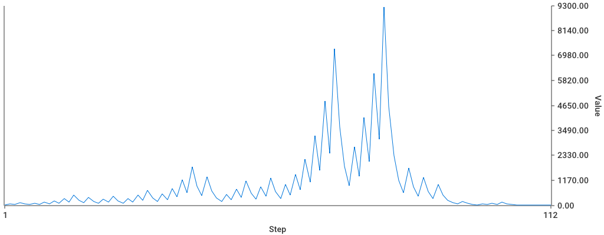

# Golang Collatz Conjecture Chart Generator

Simple app to generate image using [go-chart](github.com/wcharczuk/go-chart) for Collatz Conjecture Chart.

I'm just curious about the simplest math problem no one can solve on youtube from Veritasium [here](https://youtu.be/094y1Z2wpJg).

Just try to play with it!

## flag
`num` : the start number for collatz conjecture

`print`: the flag for printing each value of collatz conjecture [true/false]

`delay`: the number in millisecond of delay each value being printed

## example

```
go run main.go -num=5 -print -delay=100
```

## result


